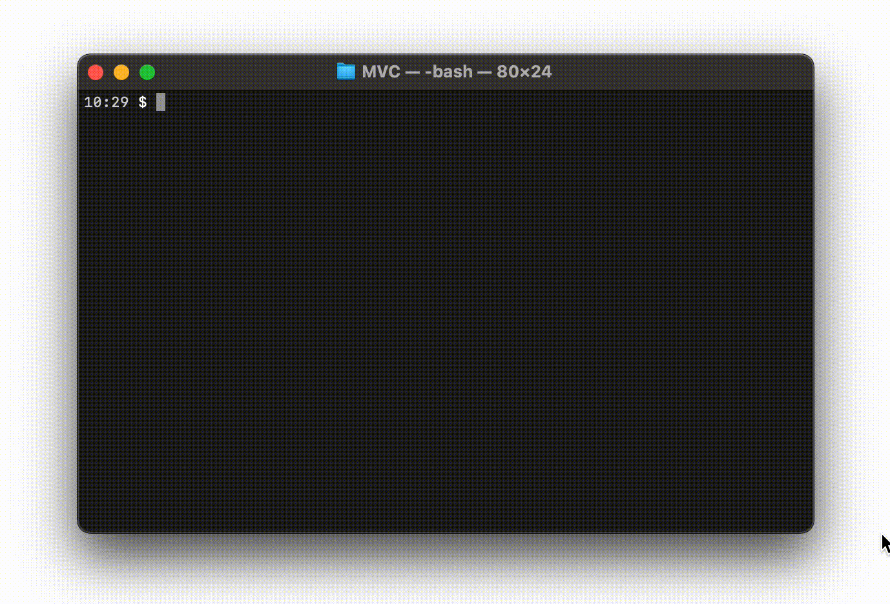

# Flashcards

## Введение

Вам предстоит создать приложение для флэш-карт, которое должно работать как показано на Рисунке 1. Перед написанием приложения вам предстоит спроектировать его объектную архитектуру. Это значит, что вам нужно будет понять какие классы будут созданы и как они будут взаимодействовать между собой. Также вы познакомитесь с шаблоном проектирования MVC (Model-View-Controller) в его самой простой форме.

_Рисунок 1_. Пример реализации флэш-карты.

## Releases

### Pre-release: описание и проектирование приложения

Давайте договоримся о том, как вы будете выстраивать ваше приложение. Как выглядит игра с колодой флэш-карт – от момента загрузки данных в файл до проверки того, верна ли ваша догадка? Что должно происходить? Приложение должно работать так, как было показано на Рисунке 1, но не обязательно должно быть его точной копией: например, можно дать пользователям не одну, а несколько попыток на отгадывание карточки.

Когда у вас сформируется четкое понимание того, что должно происходить, то можно приступать к разработке приложения. Нарисуйте черновой вариант классов, которые собираетесь создать, их взаимодействие между собой, а также общий ход программы.

#### Какие классы должны быть в вашем приложении?

Обычно создавать классов больше чем требуется считается плохой практикой (так называем оверинжиниринг). Однако, в этом проекте вы можете дать волю своей фантазии и создать столько классов сколько сможете придумать. Главное, что у каждого класса должна быть своя чёткая ответственность.

Подсказку в том какие классы вам нужны можно почерпнуть из шаблона проектирования графических приложений MVC. Не нужно сейчас гуглить и читать про этот паттерн. Он довольно сложен для начинающих. Однако, стоит усвоить, что такое Model и View (Представление).

**Модель** отвечает за работу с данными и их хранение. Модель - это не один класс, классов модели может быть много. Например, в вашем случае это могут быть Темы, Вопросы, Класс читающий всё это из файла, Класс отвечающий за логику игры и подсчёт очков.

**Представление** (так же не обязательно один класс) - отвечает за отображение приложения на экране. Обычно представлениям доступна модель (например, список вопросов, количество очков и т.д.) и по ней оно строит отображение.

Модель и Представление взаимодействуют таким образом:

1. Создаются объекты модели и в них загружаются начальные данные (темы, вопросы, очки и т.д.)
2. Объекты представления берут объекты модели и согласно им отображают пользовательский интерфейс на экране.
3. Пользователь взаимодействует с интерфейсом.
4. Представление вызывает методы модели, чтобы изменить её.
5. Модель меняется и представление перерисовывается согласно этим изменениям.
6. Всё повторяется с пункта 2.

Кроме классов Модели и Представления могут быть и другие классы. Вашу фантазию в этом проекте никто не ограничивает!

Этот release занимает приблизительно 1 час. Если вы потратили больше времени и чувствуете, что застряли, то найдите человека, который поможет вам справиться с возникшей проблемой.

### Release 1: Code

Пора кодить! У вас есть папка `topics`, в которой лежат несколько файлов с флеш-карточками (вопросами и ответами). Например, `nighthawk_flashcard_data.txt`. Пользователь должен иметь возможность воспользоваться и работать с любым из этих файлов. Будет здорово если вы создите собственные файлы со своими вопросами.

НЕОБЯЗАТЕЛЬНОЕ УСЛОВИЕ: Будет здорово если вы попрактикуете ещё и работу с промисами. Используйте методы `fs`, которые возвращают промисы.
